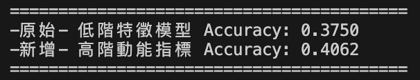
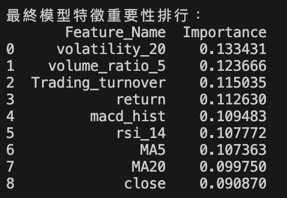
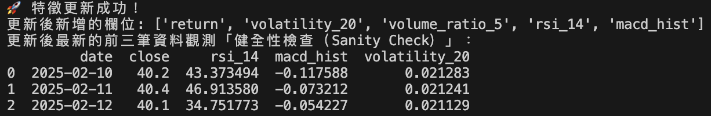
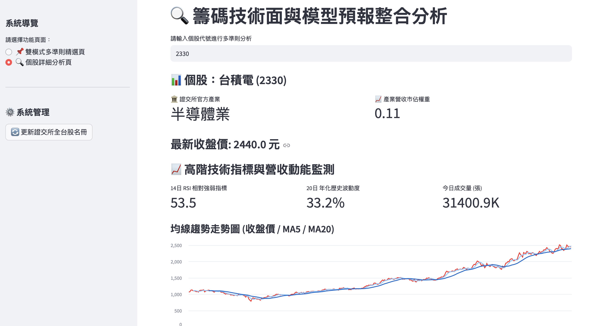
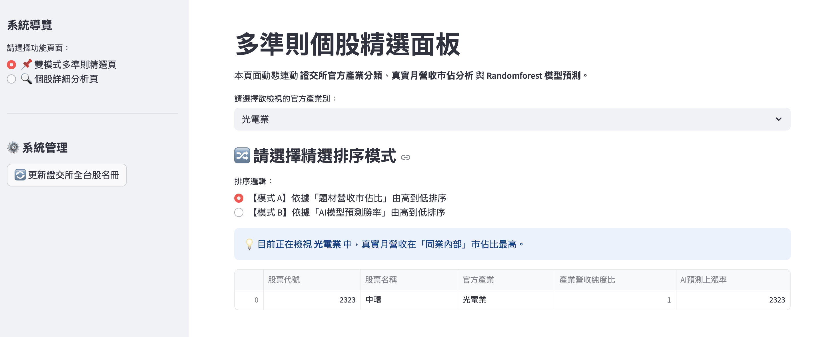
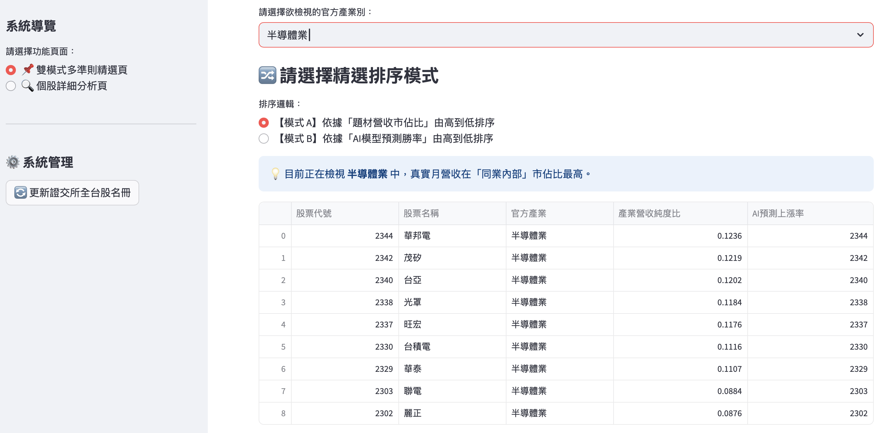
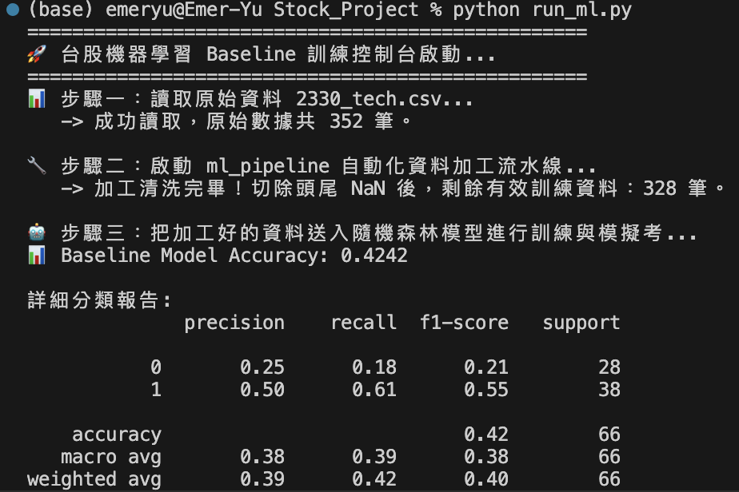
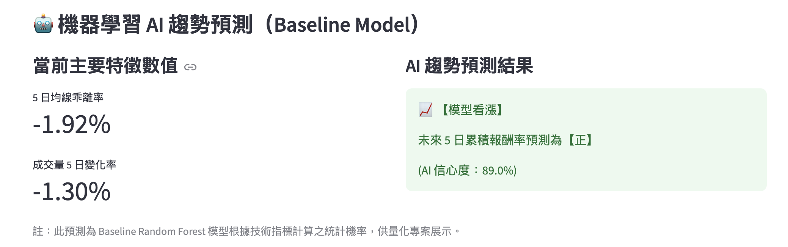

# 專案實作 4 ：優化特徵工程、精選頁排序與分析頁視覺化

## 任務目標
- 強化模型輸入特徵，提升目前簡易模型的可用性與解釋性 。 
- 完成精選頁排序邏輯，讓使用者可以直接看到較值得關注的股票池。
- 完成分析頁的圖表呈現，將技術面、籌碼面與模型結果整合到同一頁面 。 

### 簡易分析報告
- 模型新增特徵有 macd_hist、volume_ratio_5、rsi_14、volatility_20、Trading_turnover
- 但因為台股個股數量太多，以數字小到大排序後，刪除 2345 以後個股，先以 288 檔個股做分析。
#### 新增特徵後的 accuracy 從 37.5 提升至 40.62

- 台股的個股營收佔比、產業類別資料來源：台灣證券交易所（TWSE）。「本來是使用FinMind，但是被限制流量，所以改為TWSE」
#### 特徵重要性排行

#### 確保資料抓取正確性，，新增健全性檢查數據

### Streamlit 畫面呈現
#### 新增技術指標特徵後的個股詳細分析頁面

#### 針對不同產業可以選擇「營收佔比」或「模型預測」來進行個股排序

### 遇到的問題
- 在 streamlit頁面上按下「更新證交所資料」鍵後，後台會更新資料，但更新資料後所產出的資料無法再現，不知道是哪裡出了問題。

- Streamlit 頁面呈現的相關數據與實際狀況有落差，感覺是抓錯資料，但不知道怎麼查

## ------------------------- ##

# 專案實作 3 ：台灣股市機器學習趨勢預測系統

## 任務目標
將個股逐檔輸入的題材分析，改成可對全市場股票先分類、再篩選。
加入一個簡單機器學習模型，先用技術面與籌碼/營收相關欄位做二元分類，例如預測「隔日上漲/下跌」或「是否高於短期合理區間」這類簡化標籤 。

### 簡易分析報告
- 台股清單透過 台灣證券交易所（TWSE）的開放 API 或網頁公開資訊
- 以「產業」及「題材」進行分類，並將結果導出至 stock_list_with_industry.csv 中，供前端 Streamlit 使用。
- 機器學習
    - 輸入特徵：原始收盤價、成交量 → 轉化為 5 日均線乖離率與成交量 5 日變化率。
    - 預測目標：未來 5 日累積報酬率方向（正報酬 → 看漲；負報酬 → 看跌）
- 結果評估
    - 將數據以時間軸 8:2 切分進行準確率評估，以 Random Forest 模型在 台積電（2330）測試出整體準確率 (Accuracy)：約為 42.4%。
    - 準確率低於隨機值，初步判斷可能因輸入特徵較少，未來若新增輸入特徵，有機會提升整體準確率。

## 成果畫面展示(以 2330 為例)
### 整體準確率分析畫面

### streamlit 介面呈現

